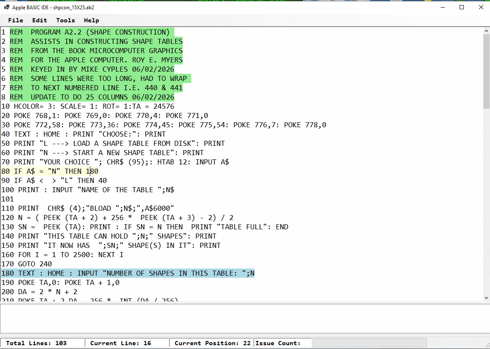

# Apple BASIC IDE

A Windows editor and analysis tool for Apple II BASIC source code.

## Features

- Open and save `.AB2` and text files
- Tracks unsaved changes and prompts before closing
- Validates `GOTO`, shorthand `THEN`, and `GOSUB` targets
- Detects duplicate and malformed line numbers
- Highlights the current line, referenced targets, comments, and errors
- Renumbers programs and updates branch targets
- Find, Select All, Cut, Copy, and Paste commands
- Double-click an analysis issue to jump to its source line

Apple BASIC project files begin with an `APPLEIIBASIC` header. The header is
managed automatically and is not shown in the editor.

## Build

Open `AppleBasic_IDE.sln` in Visual Studio, or run:

```powershell
dotnet build AppleBasic_IDE.sln
```

## Requirements

- Windows
- .NET 5.0 Desktop Runtime or SDK

## Screenshot



## Author

Mike Cyples
